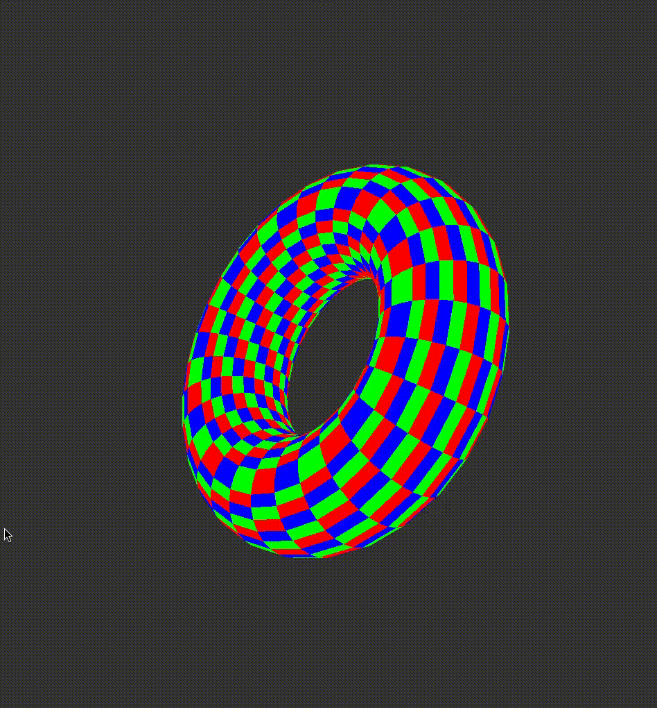
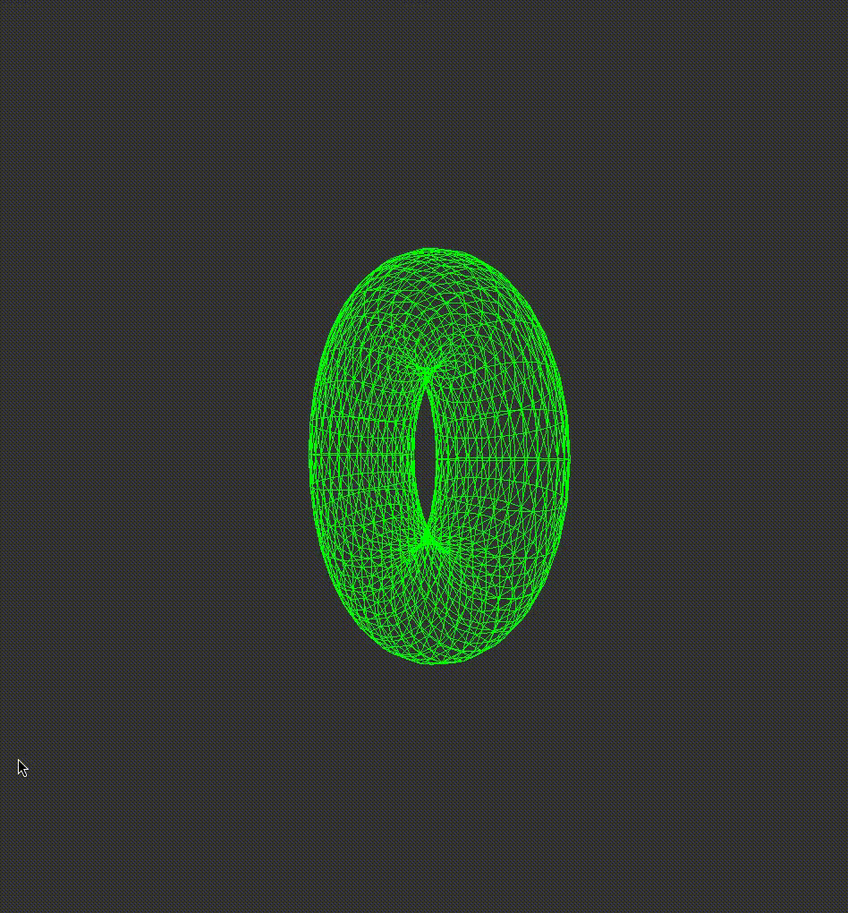

# TP01 — Surfaces de révolution

L'objectif de ce TP est de générer une surface 3D à partir d'une courbe paramétrique. La courbe est d'abord définie dans un plan, puis tournée progressivement autour d'un axe. Les différentes positions obtenues sont ensuite reliées afin de construire le maillage de la surface.

## Construction du tore

Pour tester la génération d'une surface de révolution, j'ai choisi de construire un **tore**.

Le raisonnement consiste à partir d'un cercle, mais à ne pas le centrer sur l'origine. Le cercle est décalé afin de laisser une distance entre son centre et l'axe de rotation. En faisant ensuite tourner ce cercle autour de l'origine, il décrit progressivement un tore.

La courbe initiale est calculée avec :

```cpp
Point Viewer::calculatePoint(float t) {
    return {
        static_cast<float>(10.f + 4.f * sin(t * M_PI * 2)),
        static_cast<float>(4.f * cos(t * M_PI * 2)),
        0.f
    };
}
```

Les termes :

```cpp
4.f * sin(t * M_PI * 2)
4.f * cos(t * M_PI * 2)
```

décrivent un cercle de rayon 4 lorsque `t` varie entre 0 et 1.

Le `+ 10.f` sur la coordonnée `x` permet de décaler le centre du cercle par rapport à l'origine. Sans ce décalage, la rotation du cercle autour de l'axe ne permettrait pas d'obtenir la forme du tore recherchée.

Enfin, `z` reste initialement à 0, puisque toute la courbe est définie dans un même plan.

Une fois ce cercle obtenu, chaque point est progressivement tourné autour de l'axe avec :

```cpp
Point Viewer::rotatePoint(Point p, float angle) {
    return {
        p.z * sin(angle) + p.x * cos(angle),
        p.y,
        p.z * cos(angle) - p.x * sin(angle)
    };
}
```

Cette fonction applique une rotation sur les coordonnées `x` et `z` tout en conservant `y`. En répétant cette opération entre 0 et \(2\pi\), le cercle effectue un tour complet autour de l'axe et génère l'ensemble des points du tore.

## Construction du maillage

Entre deux positions successives du cercle, quatre points sont récupérés :

```text
p3 -------- p4
 |        / |
 |      /   |
 |    /     |
 |  /       |
p1 -------- p2
```

J'ai choisi de former directement deux triangles à partir de ces quatre points plutôt qu'un quadrilatère :

```cpp
drawTriangle(p1, p2, p3);
drawTriangle(p2, p3, p4);
```

Cette opération est répétée sur toute la courbe puis sur l'ensemble de la rotation afin de construire le maillage complet.

## Résultat

Les couleurs rouge, bleu et vert sont alternées entre les différentes paires de triangles afin de mieux visualiser la construction du maillage.



Le maillage peut également être affiché uniquement sous forme d'arêtes avec :

```cpp
glPolygonMode(GL_FRONT_AND_BACK, GL_LINE);
```



## Compilation

```bash
cmake -S . -B build
cmake --build build
./build/qglviewer_test
```
