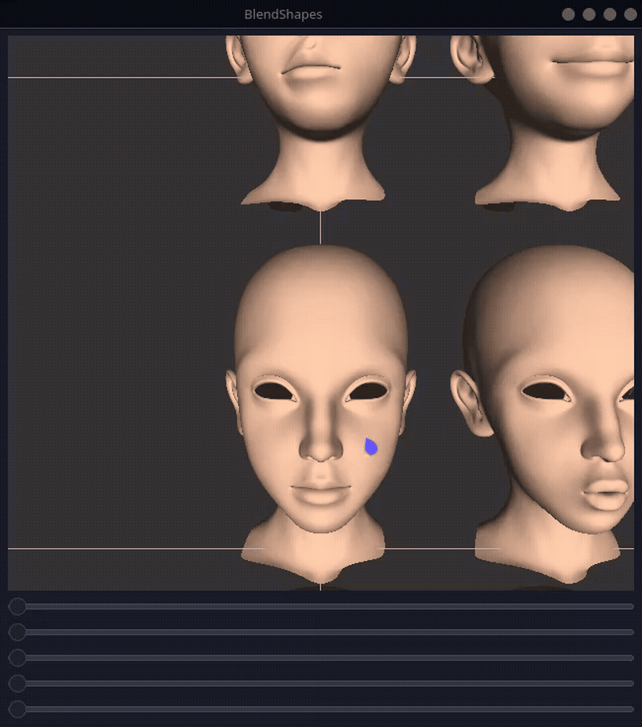

# TP02 - BlendShapes

## Implémentation

Pour cette fonction, il faut que les 2 meshs soient identiques, soit le nombre de vertices et les indices. Ensuite on calcule la difference de chaque vertex au sommet equivalent de l'autre mesh. Et on stocke tout ça dans le vector differences.

```cpp
void BlendShape::computeDifferences(BlendShape * b0)
{
    if (vertices.size() != b0->vertices.size())
        throw std::runtime_error("Cannot compute differences if BlendShape don't have the same size !");

    differences.resize(
        vertices.size(),
        {0.f, 0.f, 0.f}
    );

    for (int i = 0; i < vertices.size(); i++) {
        differences[i] = vertices[i]->position - b0->vertices[i]->position;
    }
}
```

Et pour cette fonction, déjà on recup la position par default de chaque vertex avant d'appliquer les modifications, puis on applique les modifs sur positionCour, sinon les modifications s'accumulent. Puis on applique la formule donné dans le sujet.

```cpp
void Viewer::updateBS()
{
    cout << "slider moved" << endl;
    //TODO : compute shape (blendshapes[0]) from the blendshapes and the weights

    for (size_t i = 0; i < blendshapes[0]->vertices.size(); ++i) {
        Vec position = blendshapes[0]->vertices[i]->position;

        for (size_t j = 1; j < blendshapes.size(); ++j) {
            position += blendshapes[j]->differences[i] * bs_weights[j];
        }
        
        blendshapes[0]->vertices[i]->positionCour = position;
    }
    
    update(); //To refresh rendering
    cout << "bs updated" << endl;
}
```

## Démo



## Compilation

```bash
cmake -S . -B build
cmake --build build
./build/blendshape
```
